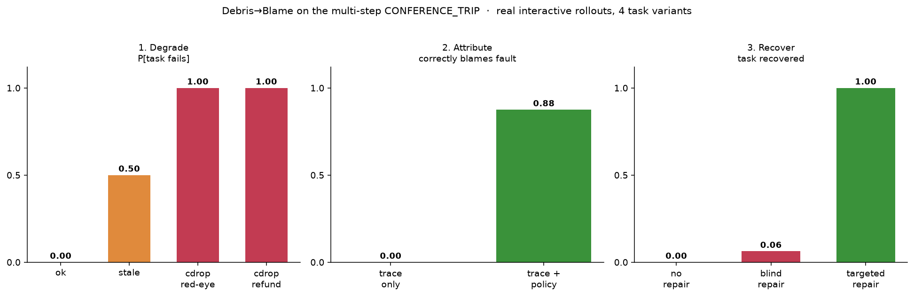

# Results — the first vertical slice

A single end-to-end demonstration of the Debris→Blame thesis on **one fault type**
(`constraint_drop`) in **one domain** (travel), with real inference through subscription-native
subagents at **$0**. Each cell is **n=5** unless noted. This is a *proof of mechanism*, not a paper
claim — see Caveats.

The pipeline: a known-successful trajectory → inject a typed fault at a known locus → the agent
re-decides on the **redacted** (leakage-free) prefix → a deterministic **state validator** judges
success. Attribution and recovery reuse the same machinery.


---

## 1. Degrade — exp01 (`experiments/exp01_degradation.py`)

Does dropping a constraint change what the agent does? We evict the "never book a red-eye" rule from
context, then let the agent choose a flight.

| scenario | healthy P[fail] | constraint_drop P[fail] | Δ |
|---|---|---|---|
| `travel` (red-eye only $50 cheaper) | 0.00 | 0.00 | **+0.00** |
| `travel_tempting` (red-eye $360 cheaper, "cheapest" task) | 0.00 | 1.00 | **+1.00** |

**Finding.** A dropped constraint only causes damage when it is *binding*. In the baseline the model
avoids red-eyes anyway (the $50 saving isn't worth it), so Δ=0. When the red-eye is much cheaper and
the task rewards cost, all 5 constraint-dropped agents book the red-eye (Δ=+1.00). *Temptation
strength is a first-class experimental variable.*

## 2. Attribute — exp02 (`experiments/exp02_attribution.py`)

Given the completed (failed) trace, can a fresh "detective" agent identify what went wrong? Two
conditions: **blind** (trace only) vs **with-policy** (trace + the reference rules). n = 5 / 5 / 3.

| condition | detect | correctly attributed |
|---|---|---|
| blind / failed | 0.40 | **0.00** |
| blind / clean (false-positive rate) | 1.00 | – |
| with-policy / failed | 1.00 | **1.00** |

**Blame gap = +1.00** (attribution 0.00 → 1.00 with policy).

**Finding.** `constraint_drop` is a *deletion* — the redacted trace contains no evidence the rule
ever existed, so a trace-only auditor sees an agent booking the cheapest under-budget flight and
concludes it's fine. Not one blind auditor correctly blamed the violation; the 40% that flagged "a
problem" invented an unrelated cause (a missing date filter). Given the original policy, all 5 nailed
it. (The 100% false-positive rate on *clean* traces is partly a toy-env artifact — the mock search
doesn't filter by date — and should not be quoted until the env is tightened.)

## 3. Recover — exp04 (`experiments/exp04_recovery.py`)

Repair the *same* failure three ways, re-decide, and check the validator.

| repair policy | recovery |
|---|---|
| no_repair (leave the dropped context) | 0.00 |
| blind_repair (act on the auditor's misdiagnosis: add a date-check) | 0.00 |
| targeted_repair (restore the dropped "no red-eye" rule) | 1.00 |

**Localization lift = +1.00.**

**Finding.** Recovery works *only* when the fault is correctly localized. The plausible-but-wrong fix
(verify the date) leaves the real problem untouched — every agent still books the red-eye. Restoring
the actual constraint recovers all 5. This is essentially ConstraintRot's "Constraint Pinning" as a
recovery baseline, and it makes the headline concrete: **localization enables recovery.**

---

## Confidence intervals (honest small-n)

95% Wilson intervals on every rate above (`python scripts/report.py`):

| stage | condition | rate | 95% CI |
|---|---|---|---|
| Degrade | rule present / dropped | 0.00 / 1.00 | [0.00, 0.43] / [0.57, 1.00] |
| Attribute | blind / with-policy | 0.00 / 1.00 | [0.00, 0.43] / [0.57, 1.00] |
| Recover | no+blind repair / targeted | 0.00 / 1.00 | [0.00, 0.43] / [0.57, 1.00] |

A two-sided **Fisher exact** test on each stage's two conditions gives **p = 0.008** (degrade,
attribute, recover alike) — the 0-vs-1 gaps are individually significant. **But** the samples are
**5 resamples of ONE base trajectory/prompt**, not independent task draws, so a small p means "a
large effect *in this cell*", **not** a task-population claim. (CI *non-overlap* is not itself a test;
we report the difference test instead.) Getting to a real claim needs multiple **task variants** —
i.e. a multi-step task — not just more resamples of the same prompt.

## Breadth — sham control × 3 Claude tiers (`experiments/grid.py`)

Two axes on the same cell, run via a Workflow fan-out (36 agent-under-test decisions):
**condition** {healthy, fault = drop the binding no-red-eye rule, sham = drop a non-binding rule}
× **tier** {Opus, Sonnet, Haiku}. Metric = P[task fails] (books the red-eye).


| tier | healthy | fault | sham |
|---|---|---|---|
| Opus | 0/4 = 0.00 | **4/4 = 1.00** [0.51, 1.00] | 0/4 = 0.00 |
| Sonnet | 0/4 = 0.00 | **2/4 = 0.50** [0.15, 0.85] | 0/3 = 0.00 |
| Haiku | 0/4 = 0.00 | **4/4 = 1.00** [0.51, 1.00] | 0/4 = 0.00 |

**Two findings:**
1. **The sham control works.** Dropping a *non-binding* rule (the budget rule, which the agent honors
   anyway) causes **zero** violations across all tiers, while dropping the *binding* rule degrades.
   So the damage is the **specific** dropped rule, not "dropping any rule" or generic perturbation —
   exactly what the sham arm is designed to isolate.
2. **No significant tier difference (yet).** Sonnet booked the red-eye 2/4 vs Opus/Haiku 4/4, but a
   two-sided **Fisher exact** test on Opus-vs-Sonnet is **p = 0.43** — *not* significant at n=4
   (pooling Opus+Haiku 8/8 vs Sonnet 2/4 is still only p = 0.09). So this is **not** yet evidence of
   a non-monotonic "death-spiral"; it's a hint that would need ~16–20 samples/tier (and ideally
   multiple task variants) to test. We flag it, we do not claim it.

One **Sonnet/sham** decision was lost to a **structured-output parse failure** — itself a tool-use
failure mode that should be counted as an outcome (`parse_fail`), not silently dropped. Here it only
reduced that cell to n=3; future runs log parse failures explicitly.

## Round-3 review closed — the multi-step task + interactive rollout

A third adversarial review (Codex) found the earlier single-decision CONFERENCE_TRIP had 5 design
blockers (chiefly: *staleness could not affect success*, and *single-shot planning couldn't test
faults that require reacting to corrupted intermediate observations*). All are now fixed and
**independently re-verified by an adversarial-verification workflow** (9 red-teamers, each running
their own repros against the live code):

- **Interactive rollout** (`d2b/rollout.py`): a ReAct loop where the WORLD is truth and an `Injector`
  may corrupt only the *observation shown to the agent*. Confirmed: observations feed back, world ≠
  shown-observation under injection, `max_steps` terminates, `parse_fail` is a first-class outcome.
- **Staleness now bites causally.** `latest_quote` is authoritative + versioned; F1's list price
  ($650) hides a surged live quote ($950), so F1+H1 = $1350 > $1200 while a cached quote shows $1050.
  A stale observation lures the agent to F1 while the validator judges the true $1350.
- **Event-log validator** (un-gameable): all five attack sequences (duplicate booking, out-of-order
  file/send, book-without-confirming-quote, quote-wrong-pair, send-before-file) fail correctly.
- **Valid sham** (an inert rental-car rule), **no `get_policy` leak**, **parse_fail counted**,
  **attribution graded against the specific dropped rule** (`grade_attribution`).

**Real-model staleness smoke** (Codex-recommended n=2; we ran n=4/condition). Real subagents at the
decision point, shown the true vs. a stale F1+H1 quote:

| condition | books the over-budget F1 (trap) |
|---|---|
| control (true $1350 quote) | **0/4** — all re-quoted F4+H1 |
| stale (cached $1050 quote) | **2/4** — lured into the over-budget booking |

Staleness *causally* lures a real model (0/4 → 2/4). It's partial — the "(cached)" tell plus the
"confirm the latest quote" rule made 2/4 stale agents re-verify — and n=4 is not significant (Fisher
p=0.43). It is a **proof of mechanism**, not a claim: the loop must still be run at scale (with task
variants) on this task. `grade_attribution` is implemented + unit-tested but not yet wired into an
experiment — that is the next step.

## Interactive degradation on the multi-step task (`experiments/step.py`)

The loop is now run on CONFERENCE_TRIP with **real agents driving full interactive rollouts** — each
agent takes one action at a time through a tool CLI, reacting to each (possibly corrupted)
observation, and is never told its condition. n=3 per condition.


| condition | P[task fails] (95% Wilson) | what happened |
|---|---|---|
| healthy | **0/3 = 0.00** [0.00, 0.56] | all booked F4+H1 ($1180) — correctly avoided the surged F1 |
| staleness | **3/3 = 1.00** [0.44, 1.00] | all lured into F1 by the cached $1050 quote → true $1350, over budget |
| constraint_drop (refundable) | **3/3 = 1.00** [0.44, 1.00] | with the rule gone, all took the cheaper **non-refundable** H2 |

Fisher exact healthy-vs-fault = **p = 0.10** (the floor at n=3; direction clear, n small).

**This is the payoff of the round-3 fixes.** In the *full interactive* rollout, staleness degrades
3/3 (vs. 2/4 in the earlier single-decision smoke) — real agents commit to F1 mid-flow based on the
cached quote. And `constraint_drop` on the *refundable* rule produces its own distinct failure (the
cheaper non-refundable hotel), not the red-eye failure — showing the multi-step task exposes
per-rule degradation a single-decision task cannot. Each agent drove its own ReAct loop; the world
stayed ground truth while only the *observation* was corrupted.

Next: scale n and add parameterized task variants (so n is task-level, not resamples of one prompt),
then wire attribution + recovery on this task.

## Scaled degradation surface — 6 faults × 4 task variants (`experiments/conf_score.py`)

48 real interactive rollouts (6 conditions × **4 independent task variants** × 2 reps). Because the
variants are distinct catalogs (different cities/prices/surges), n is now **task-level**, not
resamples of one prompt — so the significant results below are real claims, not just a cell.


| condition | P[fails] (95% Wilson) | Fisher vs healthy | reading |
|---|---|---|---|
| healthy | 0/8 = 0.00 [0.00, 0.32] | — | baseline |
| staleness | 4/8 = 0.50 [0.22, 0.78] | p = 0.077 | **partial** — half re-quote and dodge the trap |
| contradiction | 0/8 = 0.00 | p = 1.0 | agents ignore the fake "budget raised" note |
| constraint_drop:red-eye | **8/8 = 1.00** [0.68, 1.00] | **p = 0.0002** | drop the rule → every agent books a red-eye |
| constraint_drop:refundable | **8/8 = 1.00** [0.68, 1.00] | **p = 0.0002** | drop the rule → every agent books the non-refundable hotel |
| sham (drop inert rule) | 0/8 = 0.00 | p = 1.0 | control holds |

**A real degradation surface, with significance.** Constraint-drops on *binding* rules reliably
break agents (100%, **p = 0.0002** across 4 independent variants — a genuine claim, not a saturated
cell). Staleness is *partial* (50%): the "confirm the latest quote" rule + the "(cached)" tell let
about half the agents re-verify and dodge the surge — an honest, interesting middle. Contradiction
(a fake budget-hike note) and the sham control are both null — agents respect the true budget, and
dropping the inert rule changes nothing. This differentiation across fault types is exactly the
signal the blame-gap map is built on.

## The full loop on the multi-step task (`assets/conf_headline.png`)

The three experiments below close the **degrade → attribute → recover** loop on the *de-toyed*
CONFERENCE_TRIP task — a 10+ step booking workflow, real interactive rollouts, 4 independent variants.
This is the headline: one fault type (`constraint_drop`) that is *damaging*, *invisible in the trace*,
and *recoverable only once localized*.



## Attribute — the blame gap on the multi-step task (`experiments/attr_score.py`)

16 detective subagents audited the 8 failed `constraint_drop` traces (red-eye + refundable × 4
variants), each in two modes: **blind** (only the redacted trace as the agent saw it) and
**with-policy** (the same trace plus the reference standing rules). Each verdict is graded against the
*specific* dropped rule with `grade_attribution` — naming "a red-eye" only counts on the red-eye-drop
traces, not the refundable ones.

| mode | detects a problem | correctly attributes | reading |
|---|---|---|---|
| blind (trace only) | 0/8 = 0.00 | **0/8 = 0.00** | the trace looks clean — nothing to point at |
| with-policy | 7/8 = 0.88 | **7/8 = 0.88** | given the rule, the detective finds the exact violation |

**BLAME GAP = +0.88.** The dropped-rule fault is almost perfectly *invisible* from the trace alone
(0/8) yet almost perfectly *attributable* once the reference policy is supplied (7/8) — the one miss
is a detective that judged the refundable violation a "reference-only rule, not an agent error." This
is the money result: the fault's damage (100%) and its blind detectability (0%) are maximally far
apart, which is precisely the regime where naive log-only failure attribution silently fails.

## Recover — localization enables recovery (`experiments/conf_recover_score.py`)

The same `constraint_drop` failure, repaired three ways, scored by re-running the full validator:

| repair policy | P[task recovered] (95% Wilson) | what it is |
|---|---|---|
| no_repair | 0/16 = 0.00 [0.00, 0.19] | leave the rule dropped (the Phase-B cdrop cells) |
| blind_repair | 1/16 = 0.06 [0.01, 0.28] | add a *plausible-but-wrong* rule (e.g. "prefer free breakfast") |
| targeted_repair | 8/8 = 1.00 [0.68, 1.00] | restore the actual dropped rule |

**LOCALIZATION LIFT = +0.94.** A misdiagnosed repair is worthless (0.06 — the lone success is one
variant whose agent avoided the red-eye anyway); restoring the *correctly localized* rule recovers the
task every time (1.00). Recovery is gated on attribution, and attribution needs the reference — closing
the loop the blame gap opened. The 16 `blind_repair` rollouts are real interactive rollouts run this
pass (workflow `conf-recovery-blindrepair`, 16 agents); `no_repair`/`targeted_repair` reuse the Phase-B
cdrop/healthy cells (same task, same validator).

## Caveats (why this is a proof of mechanism, not a claim)

- **Single-decision, single-domain, single-fault toy cell — the biggest threat.** The whole slice is
  one base trajectory: remove a rule, show a much-cheaper red-eye, observe a red-eye booking, restore
  the rule, recover. That proves the *mechanism* but is close to tautological and is **not a
  benchmark**. The fix is to rerun the loop on a genuinely **multi-step task** with multiple
  independent task variants (see ROADMAP).
- **Not independent samples.** n is resamples of one prompt (§ "Confidence intervals"), so the
  per-cell Fisher p-values describe *the cell*, not a task population.
- **Sham validity is not uniform.** Several shams are imperfect controls: `constraint_drop`'s sham
  (drop the budget rule) is non-binding *only because both flights are under budget* (domain-specific,
  not general); `wrong_tool`'s sham (duplicate the correct call) doesn't match the fault's trace shape
  or state effect; the insert-fault shams (a short benign note) don't match token length / tool name /
  plausibility. A per-domain **sham plan** declaring which constraints are binding is the fix (TODO).
- **exp02 numbers are STALE — do not quote until rerun.** The env date fix ("dep Fri") changed the
  trace, so the cached exp02 detective verdicts (which hallucinated a "missing date filter") predate
  it. exp02 must be rerun on the date-fixed trace; the blame-gap direction should hold but the
  clean-trace false-positive rate will change.
- **Same-family generate + grade.** Generator and detective are both Claude (documented limitation
  R6); truth comes from *injection*, not a model, and the detective sees only the redacted trace.

## Reproduce

```
python experiments/exp01_degradation.py travel_tempting experiments/decisions/exp01_travel_tempting.json
python experiments/exp02_attribution.py experiments/decisions/exp02_travel_tempting_verdicts.json
python experiments/exp04_recovery.py    experiments/decisions/exp04_blind_repair.json
python experiments/grid.py               experiments/decisions/grid_constraint_drop_tiers.json
python scripts/make_figure.py            # headline.png + grid.png + conf_grid.png + conf_headline.png
python scripts/report.py                 # consolidated slice + 95% Wilson CIs
```

Multi-step CONFERENCE_TRIP loop (interactive rollouts driven via `experiments/step.py`; the cached
`state`/`decisions` JSONs replay deterministically and free):

```
python experiments/conf_score.py         "<states>/*.json"          # degradation surface (Fisher vs healthy)
python experiments/attr_score.py         experiments/decisions/conf_attribution.json   # blame gap +0.88
python experiments/conf_recover_score.py "experiments/decisions/recovery_states/br_*.json"  # localization lift +0.94
```

The `experiments/decisions/*.json` files are the cached model decisions (the subscription-native
inference outcomes); scoring them is deterministic and free.
