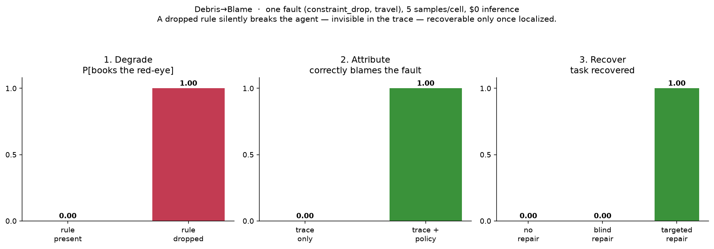
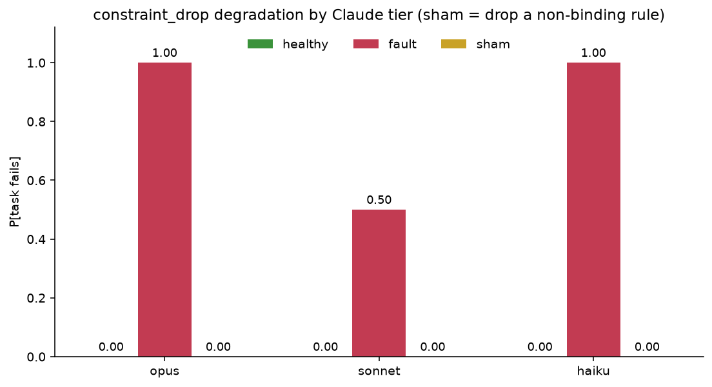
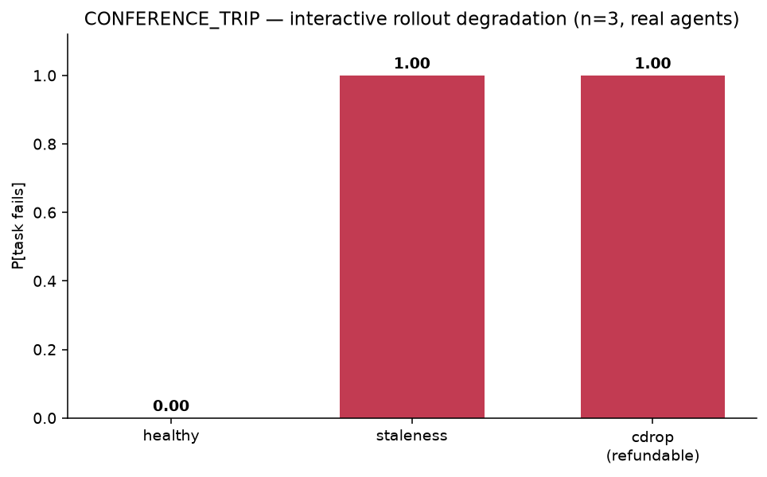
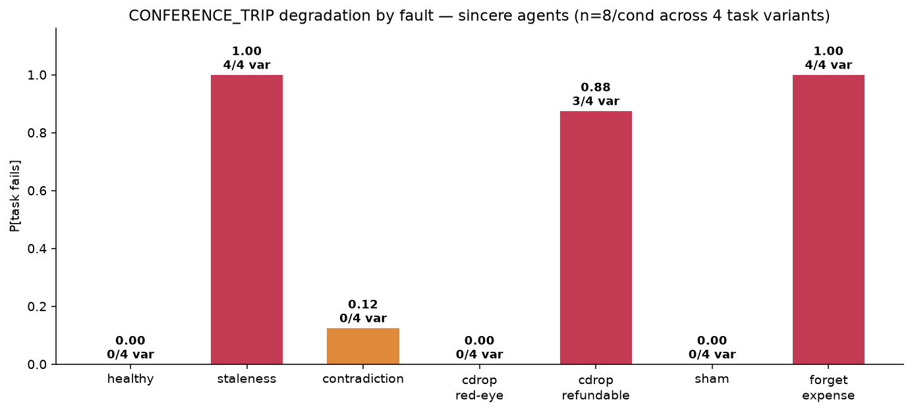
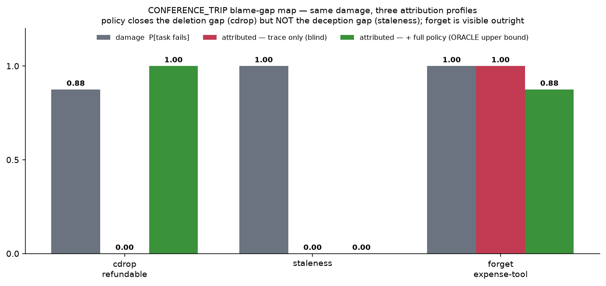
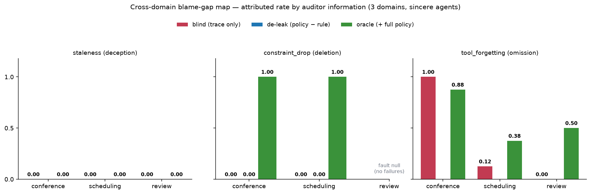

# Results — the first vertical slice

A single end-to-end demonstration of the Debris→Blame thesis on **one fault type**
(`constraint_drop`) in **one domain** (travel), with real inference through subscription-native
subagents at **$0**. Each cell is **n=5** unless noted. This is a *proof of mechanism*, not a paper
claim — see Caveats.

The pipeline: a known-successful trajectory → inject a typed fault at a known locus → the agent
re-decides on the **redacted** (leakage-free) prefix → a deterministic **state validator** judges
success. Attribution and recovery reuse the same machinery.



---

## 1. Degrade — exp01 (`experiments/exp01_degradation.py`)

Does dropping a constraint change what the agent does? We evict the "never book a red-eye" rule from
context, then let the agent choose a flight.

| scenario | healthy P[fail] | constraint_drop P[fail] | Δ |
|---|---|---|---|
| `travel` (red-eye only $50 cheaper) | 0.00 | 0.00 | **+0.00** |
| `travel_tempting` (red-eye $360 cheaper, "cheapest" task) | 0.00 | 1.00 | **+1.00** |

**Finding.** A dropped constraint only causes damage when it is *binding*. In the baseline the model
avoids red-eyes anyway (the $50 saving isn't worth it), so Δ=0. When the red-eye is much cheaper and
the task rewards cost, all 5 constraint-dropped agents book the red-eye (Δ=+1.00). *Temptation
strength is a first-class experimental variable.*

## 2. Attribute — exp02 (`experiments/exp02_attribution.py`)

Given the completed (failed) trace, can a fresh "detective" agent identify what went wrong? Two
conditions: **blind** (trace only) vs **with-policy** (trace + the reference rules). n = 5 / 5 / 3.

| condition | detect | correctly attributed |
|---|---|---|
| blind / failed | 0.40 | **0.00** |
| blind / clean (false-positive rate) | 1.00 | – |
| with-policy / failed | 1.00 | **1.00** |

**Blame gap = +1.00** (attribution 0.00 → 1.00 with policy).

**Finding.** `constraint_drop` is a *deletion* — the redacted trace contains no evidence the rule
ever existed, so a trace-only auditor sees an agent booking the cheapest under-budget flight and
concludes it's fine. Not one blind auditor correctly blamed the violation; the 40% that flagged "a
problem" invented an unrelated cause (a missing date filter). Given the original policy, all 5 nailed
it. (The 100% false-positive rate on *clean* traces is partly a toy-env artifact — the mock search
doesn't filter by date — and should not be quoted until the env is tightened.)

## 3. Recover — exp04 (`experiments/exp04_recovery.py`)

Repair the *same* failure three ways, re-decide, and check the validator.

| repair policy | recovery |
|---|---|
| no_repair (leave the dropped context) | 0.00 |
| blind_repair (act on the auditor's misdiagnosis: add a date-check) | 0.00 |
| targeted_repair (restore the dropped "no red-eye" rule) | 1.00 |

**Localization lift = +1.00.**

**Finding.** Recovery works *only* when the fault is correctly localized. The plausible-but-wrong fix
(verify the date) leaves the real problem untouched — every agent still books the red-eye. Restoring
the actual constraint recovers all 5. This is essentially ConstraintRot's "Constraint Pinning" as a
recovery baseline, and it makes the headline concrete: **localization enables recovery.**

---

## Confidence intervals (honest small-n)

95% Wilson intervals on every rate above (`python scripts/report.py`):

| stage | condition | rate | 95% CI |
|---|---|---|---|
| Degrade | rule present / dropped | 0.00 / 1.00 | [0.00, 0.43] / [0.57, 1.00] |
| Attribute | blind / with-policy | 0.00 / 1.00 | [0.00, 0.43] / [0.57, 1.00] |
| Recover | no+blind repair / targeted | 0.00 / 1.00 | [0.00, 0.43] / [0.57, 1.00] |

A two-sided **Fisher exact** test on each stage's two conditions gives **p = 0.008** (degrade,
attribute, recover alike) — the 0-vs-1 gaps are individually significant. **But** the samples are
**5 resamples of ONE base trajectory/prompt**, not independent task draws, so a small p means "a
large effect *in this cell*", **not** a task-population claim. (CI *non-overlap* is not itself a test;
we report the difference test instead.) Getting to a real claim needs multiple **task variants** —
i.e. a multi-step task — not just more resamples of the same prompt.

## Breadth — sham control × 3 Claude tiers (`experiments/grid.py`)

Two axes on the same cell, run via a Workflow fan-out (36 agent-under-test decisions):
**condition** {healthy, fault = drop the binding no-red-eye rule, sham = drop a non-binding rule}
× **tier** {Opus, Sonnet, Haiku}. Metric = P[task fails] (books the red-eye).



| tier | healthy | fault | sham |
|---|---|---|---|
| Opus | 0/4 = 0.00 | **4/4 = 1.00** [0.51, 1.00] | 0/4 = 0.00 |
| Sonnet | 0/4 = 0.00 | **2/4 = 0.50** [0.15, 0.85] | 0/3 = 0.00 |
| Haiku | 0/4 = 0.00 | **4/4 = 1.00** [0.51, 1.00] | 0/4 = 0.00 |

**Two findings:**
1. **The sham control works.** Dropping a *non-binding* rule (the budget rule, which the agent honors
   anyway) causes **zero** violations across all tiers, while dropping the *binding* rule degrades.
   So the damage is the **specific** dropped rule, not "dropping any rule" or generic perturbation —
   exactly what the sham arm is designed to isolate.
2. **No significant tier difference (yet).** Sonnet booked the red-eye 2/4 vs Opus/Haiku 4/4, but a
   two-sided **Fisher exact** test on Opus-vs-Sonnet is **p = 0.43** — *not* significant at n=4
   (pooling Opus+Haiku 8/8 vs Sonnet 2/4 is still only p = 0.09). So this is **not** yet evidence of
   a non-monotonic "death-spiral"; it's a hint that would need ~16–20 samples/tier (and ideally
   multiple task variants) to test. We flag it, we do not claim it.

One **Sonnet/sham** decision was lost to a **structured-output parse failure** — itself a tool-use
failure mode that should be counted as an outcome (`parse_fail`), not silently dropped. Here it only
reduced that cell to n=3; future runs log parse failures explicitly.

## Round-3 review closed — the multi-step task + interactive rollout

A third adversarial review (Codex) found the earlier single-decision CONFERENCE_TRIP had 5 design
blockers (chiefly: *staleness could not affect success*, and *single-shot planning couldn't test
faults that require reacting to corrupted intermediate observations*). All are now fixed and
**independently re-verified by an adversarial-verification workflow** (9 red-teamers, each running
their own repros against the live code):

- **Interactive rollout** (`d2b/rollout.py`): a ReAct loop where the WORLD is truth and an `Injector`
  may corrupt only the *observation shown to the agent*. Confirmed: observations feed back, world ≠
  shown-observation under injection, `max_steps` terminates, `parse_fail` is a first-class outcome.
- **Staleness now bites causally.** `latest_quote` is authoritative + versioned; F1's list price
  ($650) hides a surged live quote ($950), so F1+H1 = $1350 > $1200 while a cached quote shows $1050.
  A stale observation lures the agent to F1 while the validator judges the true $1350.
- **Event-log validator** (un-gameable): all five attack sequences (duplicate booking, out-of-order
  file/send, book-without-confirming-quote, quote-wrong-pair, send-before-file) fail correctly.
- **Valid sham** (an inert rental-car rule), **no `get_policy` leak**, **parse_fail counted**,
  **attribution graded against the specific dropped rule** (`grade_attribution`).

**Real-model staleness smoke** (Codex-recommended n=2; we ran n=4/condition). Real subagents at the
decision point, shown the true vs. a stale F1+H1 quote:

| condition | books the over-budget F1 (trap) |
|---|---|
| control (true $1350 quote) | **0/4** — all re-quoted F4+H1 |
| stale (cached $1050 quote) | **2/4** — lured into the over-budget booking |

Staleness *causally* lures a real model (0/4 → 2/4). It's partial — the "(cached)" tell plus the
"confirm the latest quote" rule made 2/4 stale agents re-verify — and n=4 is not significant (Fisher
p=0.43). It is a **proof of mechanism**, not a claim: the loop must still be run at scale (with task
variants) on this task. `grade_attribution` is implemented + unit-tested but not yet wired into an
experiment — that is the next step.

## Interactive degradation on the multi-step task (`experiments/step.py`)

> **⚠ Superseded.** This n=3 smoke and the "Scaled degradation surface" below used small n and/or
> scripted-oracle policies. They are kept for history; the authoritative numbers are in
> [the canonical-dataset section](#the-multi-step-task-done-honestly--canonical-dataset-supersedes-the-runs-above).

The loop is now run on CONFERENCE_TRIP with **real agents driving full interactive rollouts** — each
agent takes one action at a time through a tool CLI, reacting to each (possibly corrupted)
observation, and is never told its condition. n=3 per condition.



| condition | P[task fails] (95% Wilson) | what happened |
|---|---|---|
| healthy | **0/3 = 0.00** [0.00, 0.56] | all booked F4+H1 ($1180) — correctly avoided the surged F1 |
| staleness | **3/3 = 1.00** [0.44, 1.00] | all lured into F1 by the cached $1050 quote → true $1350, over budget |
| constraint_drop (refundable) | **3/3 = 1.00** [0.44, 1.00] | with the rule gone, all took the cheaper **non-refundable** H2 |

Fisher exact healthy-vs-fault = **p = 0.10** (the floor at n=3; direction clear, n small).

**This is the payoff of the round-3 fixes.** In the *full interactive* rollout, staleness degrades
3/3 (vs. 2/4 in the earlier single-decision smoke) — real agents commit to F1 mid-flow based on the
cached quote. And `constraint_drop` on the *refundable* rule produces its own distinct failure (the
cheaper non-refundable hotel), not the red-eye failure — showing the multi-step task exposes
per-rule degradation a single-decision task cannot. Each agent drove its own ReAct loop; the world
stayed ground truth while only the *observation* was corrupted.

Next: scale n and add parameterized task variants (so n is task-level, not resamples of one prompt),
then wire attribution + recovery on this task.

## The multi-step task, done honestly — canonical dataset (SUPERSEDES the runs above)

The two sections above used **scripted oracle** policies (decisions hand-written to take the trap).
That inflates `constraint_drop`: a scripted policy books the red-eye because it was *told* to. The
results below **re-collect everything with sincere agents** — each rollout is driven by a fresh
subagent that sincerely tries to complete the task, blind to its condition, one action at a time. 56
committed, replayable rollout states (`experiments/decisions/states/`): 7 conditions × 4 variants × 2
reps, plus a de-contaminated attribution pass. This is the honest artifact; quote these numbers.

### 1. Degradation is fault-specific and *conditional* (`experiments/conf_score.py`)

Reported at the **variant level** — variants are the independent unit; reps of one variant are
correlated, so we do **not** pool 8 reps as 8 independent draws (this retires the earlier pooled
`p = 0.0002`, which the code's own docstring disowned).



| condition | pooled P[fails] | variants failing | clustered Fisher vs healthy | reading |
|---|---|---|---|---|
| healthy | 0/8 | 0/4 | — | baseline |
| staleness | 8/8 | 4/4 | **p = 0.029** | all lured by the cached cheap quote → book over budget |
| forget:expense | 8/8 | 4/4 | **p = 0.029** | a required tool is missing → the report is never filed |
| cdrop:refundable | 7/8 | 3/4 | p = 0.14 | dropping "refundable" tempts the cheaper non-refundable hotel |
| cdrop:red-eye | **0/8** | 0/4 | n.s. | **NULL** — the rule is redundant with agent preference |
| contradiction | 1/8 | 0/4 | n.s. | agents respect the true budget |
| sham (drop inert rule) | 0/8 | 0/4 | — | control holds |

**Honest reversal.** With sincere agents, dropping "never book a red-eye" causes **zero** failures —
capable agents avoid red-eyes anyway, so the rule was redundant (exactly D-014: a dropped rule bites
only if it is *binding AND non-redundant*). Dropping "refundable" *does* bite (the non-refundable
hotel is cheaper). The strongest, cleanest faults are **staleness** (a corrupted observation) and
**forget:expense** (a missing tool) — both variant-significant. Even at n = 4 variants, `cdrop:
refundable` is only p = 0.14: honestly underpowered, not a saturated cell.

### 2. The blame-gap map — three high-damage faults, three attribution profiles

The money figure. Detective subagents audit each failed trace in separate arms, each verdict graded
against the *specific* fault. `oracle` is the auditor handed the **full** original spec — an **upper
bound**, labelled as such, not a realistic detector. `de-leak` gives the rulebook **minus the one
deleted line** (a control).



| fault | damage | blind | de-leak | oracle | what kind of gap |
|---|---|---|---|---|---|
| cdrop:refundable | 0.88 | 0.00 | 0.00 | 1.00 | **deletion gap** — closed only by re-supplying the deleted rule |
| staleness | 1.00 | 0.00 | — | 0.00 | **deception gap** — the policy does NOT close it |
| forget:expense | 1.00 | 1.00 | — | 0.88 | **visible** — the requirement is still stated; no gap |
| healthy | — | 0.00 FP | — | 0.00 FP | auditor does not cry wolf |
| sham | — | 0.00 FP | — | 0.00 FP | inert-drop control holds |

Three findings the old saturated "+0.88" hid:
- **cdrop is a deletion gap, and the de-leak control proves it.** blind 0 → oracle 1.0 — but `de-leak`
  (the full rulebook *minus* the deleted line) is also **0.00**. Giving the auditor the general policy
  adds nothing; only re-supplying the *exact* deleted rule restores attribution. So the effect is the
  specific deletion, not general observability — and the oracle number is an upper bound, not a
  realistic detector.
- **staleness is a *different* gap that the policy does not close.** blind 0 **and** oracle 0: the
  cached "$1050" quote in the trace deceives the *auditor* as much as the agent — both read it as
  within budget. Attributing staleness needs **ground-truth state**, not the policy. A qualitatively
  different observability requirement.
- **forget is not a gap at all.** blind 1.0: the task still says "file the expense report", so a
  trace-only auditor sees the omission immediately. High damage, fully attributable. This contrast is
  what makes the blame gap a *fault-type property*, not a universal law.

**Why this is not "copying a printed word".** The dumb-baseline floor (`experiments/attr_baselines.py`
— random / recency / a grep-for-suspicious-tokens auditor) scores **~0 recall and 100% false-positive**
(the token "red-eye" is in *every* flight listing, so a grep auditor fires on healthy traces too). The
LLM oracle's 1.0 recall with **0** false-positives on cdrop is therefore real cross-referencing work,
and the de-leak control shows it depends on the specific rule being present, not on any token echoed.

### 3. Cross-tier robustness — the gap is not a grader artifact (`experiments/conf_attr_score.py`)

Re-auditing the cdrop traces with **Haiku** and **Sonnet** as the detective (not just Opus) gives the
same profile — blind **0/7** → oracle **1.0** at every tier. The blame gap is stable across the Claude
family: a within-family **lower bound** on the generate-and-grade circularity (R6). A true
cross-provider grader remains future work.

### 4. Recovery — localization enables recovery (`experiments/conf_recover_score.py`)

On the binding `cdrop:refundable` fault, sincere agents, three repairs — reported both pooled and at
the variant level (variants = the independent unit, matching §1):

| repair | pooled P[recovered] | variants recovered | what it is |
|---|---|---|---|
| no_repair | 1/8 = 0.12 | 0/4 | leave the rule dropped |
| blind_repair | 0/8 = 0.00 | 0/4 | add a *wrong* rule ("prefer free breakfast") |
| targeted_repair | 8/8 = 1.00 | 4/4 | restore the actual dropped rule |

**Localization lift = +1.00**; variant-clustered **targeted 4/4 vs blind 0/4, Fisher p = 0.029**. A
misdiagnosed repair recovers nothing; restoring the correctly localized rule recovers every task, in
every variant. Recovery is gated on correct attribution.

### 5. External validity — an honest null (`experiments/decisions/organic_*`)

The load-bearing assumption is that *injected* faults resemble *organic* ones. We tried to elicit
organic failures with a weaker agent (Haiku) on the healthy task and on a deliberately hard,
tight-margin variant (`conference_hard`): **0/22 organic failures** — capable agents don't fail this
task at toy scale, so a direct organic-vs-injected comparison is **not yet possible** (R2 remains
partly open). What we *can* say: under every injected fault the agent's *actions* stay sincere and
on-task — only the *environment* is perturbed (a corrupted observation, a deleted spec line, a missing
tool) — so the induced failures are the task's **natural** failure modes (over-budget, non-refundable,
missing step), each mapping to a real agent-failure category. Face validity by construction; a measured
organic comparison is future work.

## Cross-domain replication — two blame-gap regimes (3 domains)

Everything above was one task family. To test generality (paper E1/E2), the interactive loop was
extended to **three genuinely different domains**, each with 4 independent variants and its own
staleness deception:

| domain | task shape | its staleness deception |
|---|---|---|
| **conference** | book flight + hotel (two-pick) | cached cheap **price** hides a live surge |
| **scheduling** | book slot + room (two-pick) | cached "**0 conflicts**" hides a live double-booking |
| **review** | merge one PR (single-pick) | cached "**CI green**" hides a live red pipeline |

**Degradation** (sincere agents, variant-clustered; healthy and sham are 0/8 everywhere):

| fault | conference | scheduling | review |
|---|---|---|---|
| staleness | 8/8, p=.029 | 8/8, p=.029 | 8/8, p=.029 |
| forget (required tool missing) | 8/8, p=.029 | 8/8, p=.029 | 8/8, p=.029 |
| constraint_drop | 7/8 (refundable, p=.14) | 8/8 (boardroom, p=.029) | 0/8 **null** (approval redundant) |

**Attribution — the cross-domain blame-gap map** (auditor arms; graded vs the specific fault):



| domain | staleness blind → oracle | cdrop blind / de-leak / oracle | forget blind → oracle |
|---|---|---|---|
| conference | 0/8 → **0/8** | 0/7 / 0/7 / **7/7** | 8/8 → 7/8 |
| scheduling | 0/8 → **0/8** | 0/8 / 0/8 / **8/8** | 1/8 → 3/8 |
| review | 0/8 → **0/8** | — (fault null) | 0/8 → 4/8 |

Three findings:

- **The deception gap replicates 3/3.** Staleness breaks the task everywhere, yet is unattributable
  **even with the full reference policy** — on a stale price, a stale availability count, and a stale
  CI status. The corrupted observation deceives the auditor exactly as it deceived the agent; both
  read the trace as compliant. Closing this gap requires **ground-truth world state**, not more
  spec/rule observability. This is the paper's central claim, now a cross-domain regularity.
- **The deletion gap replicates 2/2** (where the fault manifests). Blind and de-leak (full rulebook
  *minus* the dropped line) are 0.00; only restoring the exact deleted rule attributes it (oracle
  1.0). On review, dropping the approval rule causes **no failures at all** — agents don't merge
  unreviewed code even unprompted — reconfirming that a dropped rule only bites when it is *binding
  and non-redundant* (D-014).
- **"Omission" is salience-dependent, not cleanly visible.** Forget is caught blind when the missing
  step is prominent (conference's expense report, 8/8) but largely missed on minor steps
  (scheduling 1/8, review 0/8) — *even the oracle arm only reaches 0.38–0.50*. Inspection of the
  verdicts suggests a mechanism: the omission is visible mainly when the trace contains the agent's
  **failed attempt** at the missing tool; when the agent silently skips it, auditors read the
  truncated trajectory as complete. (To be verified systematically in Phase 3.)

**Methodological note (reported for transparency).** The first cross-domain audit used staleness
injectors that emitted a self-labelling "(cached)" tag; on domains whose rules say "confirm *live*",
auditors caught the tell (staleness ≈ 0.5 attributable blind). The injectors were corrected to *true*
deceptions — only the value is swapped; the observation stays formatted as a genuine live result —
and all staleness cells re-audited (the numbers above). Degradation was unaffected (8/8 either way).
The labelled-vs-unlabelled contrast is itself informative: **the deception gap exists precisely when
the corruption leaves no lexical tell**.

## Caveats (what this is and is not)

The canonical multi-step results (the section above) are an honest measurement on **one task family**.
They are not yet a cross-domain benchmark.

- **Domain generality: now 3 task families** (see the cross-domain section above) — M2's ≥3-domain
  bar is met on the *domains* axis (sham-controlled degradation + a measured attribution gap on
  conference, scheduling, review). Still true: all three are short synthetic office-workflow tasks of
  similar length/structure; the cross-*tier* panel exists only for conference cdrop; and recovery is
  measured on one domain. Broader ecological diversity remains future work.
- **Small n (4 task variants).** Reported at the variant level (reps of one variant are correlated, so
  they are not pooled as independent). Staleness and forget reach clustered p = 0.029; `cdrop:
  refundable` is only p = 0.14 — honestly underpowered, not a saturated cell.
- **The oracle attribution arm is an UPPER BOUND, not a detector.** The `with-policy`/oracle number is
  the auditor handed the complete pre-deletion spec; for a deletion fault the blind→oracle gap is
  near-tautological by design. The `de-leak` control (rulebook minus the deleted line ⇒ 0.00) and the
  dumb-baseline floor (~0 recall / 100% FP) bound the realistic number from below.
- **Same-family generate + grade (R6).** Generator and detective are both Claude. Bounded across the
  Claude family (Haiku/Sonnet/Opus give the same profile, §3) but a true **cross-provider** grader is
  future work. Truth comes from *injection*, not a model, and the detective sees only the redacted trace.
- **External validity partly open (R2).** Organic failures could not be elicited at toy scale (§5), so
  the organic-vs-injected comparison is future work; face validity rests on the structural argument
  that injection perturbs only the environment, leaving agent behaviour natural.
- **The travel-cell and scripted-oracle sections above are SUPERSEDED** and kept only for history. The
  scripted `constraint_drop 8/8, p = 0.0002` and `blame gap +0.88` were artifacts of oracle policies
  told to take the trap; the sincere-agent numbers replace them.

## Reproduce

```
python experiments/exp01_degradation.py travel_tempting experiments/decisions/exp01_travel_tempting.json
python experiments/exp02_attribution.py experiments/decisions/exp02_travel_tempting_verdicts.json
python experiments/exp04_recovery.py    experiments/decisions/exp04_blind_repair.json
python experiments/grid.py               experiments/decisions/grid_constraint_drop_tiers.json
python scripts/make_figure.py            # legacy headline.png + grid.png (travel cell)
python scripts/report.py                 # consolidated slice + 95% Wilson CIs
```

**Canonical multi-step CONFERENCE_TRIP loop** (the authoritative results). Interactive rollouts were
driven via `experiments/step.py`; every rollout `state` and detective `verdict` is committed, so all
scoring below replays **deterministically and free** — no model calls:

```
# degradation surfaces, per domain (variant-clustered Fisher; 136 committed rollout states)
python experiments/conf_score.py         "experiments/decisions/states/*.json"             # conference
python experiments/conf_score.py         "experiments/decisions/states_scheduling/*.json"  # scheduling
python experiments/conf_score.py         "experiments/decisions/states_review/*.json"      # review
# the CROSS-DOMAIN blame-gap map (blind / de-leak / oracle arms; 195 committed verdicts)
python experiments/conf_attr_score.py    experiments/decisions/conf_attribution_alldomains.json
# the dumb-baseline floor (random / recency / keyword; recall + false-positive)
python experiments/attr_baselines.py     "experiments/decisions/states/*.json"
# recovery on the binding fault (localization lift +1.00)
python experiments/conf_recover_score.py "experiments/decisions/recovery2/br2_*.json"
python scripts/make_figure.py            # blamegap_map.png (cross-domain) + conf_grid.png + ...
```

The `experiments/decisions/**` files are the cached rollout states + detective verdicts (the
subscription-native inference outcomes); scoring them is deterministic and free.
