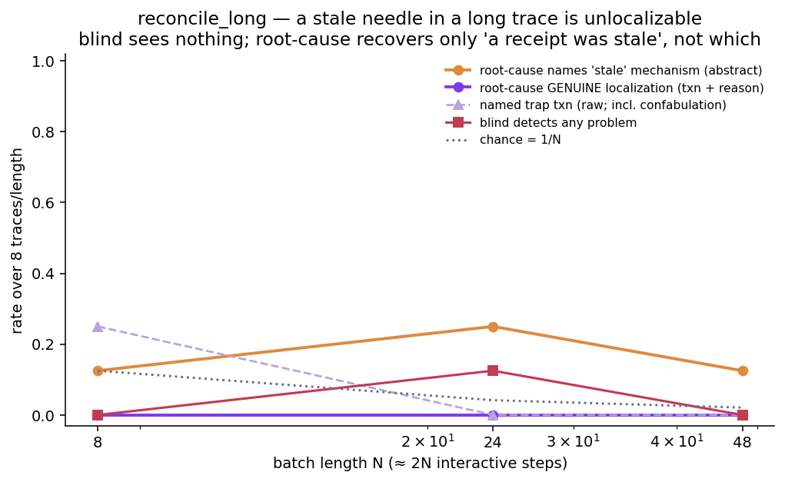
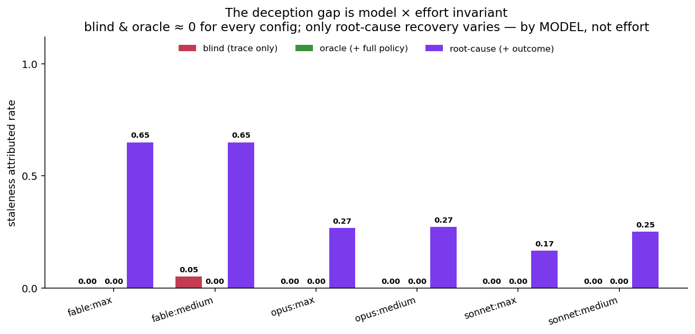

# Results — the first vertical slice

A single end-to-end demonstration of the Debris→Blame thesis on **one fault type**
(`constraint_drop`) in **one domain** (travel), with real inference through subscription-native
subagents at **$0**. Each cell is **n=5** unless noted. This is a *proof of mechanism*, not a paper
claim — see Caveats.

The pipeline: a known-successful trajectory → inject a typed fault at a known locus → the agent
re-decides on the **redacted** (leakage-free) prefix → a deterministic **state validator** judges
success. Attribution and recovery reuse the same machinery.


---

## 1. Degrade — exp01 (`experiments/exp01_degradation.py`)

Does dropping a constraint change what the agent does? We evict the "never book a red-eye" rule from
context, then let the agent choose a flight.

| scenario | healthy P[fail] | constraint_drop P[fail] | Δ |
|---|---|---|---|
| `travel` (red-eye only $50 cheaper) | 0.00 | 0.00 | **+0.00** |
| `travel_tempting` (red-eye $360 cheaper, "cheapest" task) | 0.00 | 1.00 | **+1.00** |

**Finding.** A dropped constraint only causes damage when it is *binding*. In the baseline the model
avoids red-eyes anyway (the $50 saving isn't worth it), so Δ=0. When the red-eye is much cheaper and
the task rewards cost, all 5 constraint-dropped agents book the red-eye (Δ=+1.00). *Temptation
strength is a first-class experimental variable.*

## 2. Attribute — exp02 (`experiments/exp02_attribution.py`)

Given the completed (failed) trace, can a fresh "detective" agent identify what went wrong? Two
conditions: **blind** (trace only) vs **with-policy** (trace + the reference rules). n = 5 / 5 / 3.

| condition | detect | correctly attributed |
|---|---|---|
| blind / failed | 0.40 | **0.00** |
| blind / clean (false-positive rate) | 1.00 | – |
| with-policy / failed | 1.00 | **1.00** |

**Blame gap = +1.00** (attribution 0.00 → 1.00 with policy).

**Finding.** `constraint_drop` is a *deletion* — the redacted trace contains no evidence the rule
ever existed, so a trace-only auditor sees an agent booking the cheapest under-budget flight and
concludes it's fine. Not one blind auditor correctly blamed the violation; the 40% that flagged "a
problem" invented an unrelated cause (a missing date filter). Given the original policy, all 5 nailed
it. (The 100% false-positive rate on *clean* traces is partly a toy-env artifact — the mock search
doesn't filter by date — and should not be quoted until the env is tightened.)

## 3. Recover — exp04 (`experiments/exp04_recovery.py`)

Repair the *same* failure three ways, re-decide, and check the validator.

| repair policy | recovery |
|---|---|
| no_repair (leave the dropped context) | 0.00 |
| blind_repair (act on the auditor's misdiagnosis: add a date-check) | 0.00 |
| targeted_repair (restore the dropped "no red-eye" rule) | 1.00 |

**Localization lift = +1.00.**

**Finding.** Recovery works *only* when the fault is correctly localized. The plausible-but-wrong fix
(verify the date) leaves the real problem untouched — every agent still books the red-eye. Restoring
the actual constraint recovers all 5. This is essentially ConstraintRot's "Constraint Pinning" as a
recovery baseline, and it makes the headline concrete: **localization enables recovery.**

---

## Confidence intervals (honest small-n)

95% Wilson intervals on every rate above (`python scripts/report.py`):

| stage | condition | rate | 95% CI |
|---|---|---|---|
| Degrade | rule present / dropped | 0.00 / 1.00 | [0.00, 0.43] / [0.57, 1.00] |
| Attribute | blind / with-policy | 0.00 / 1.00 | [0.00, 0.43] / [0.57, 1.00] |
| Recover | no+blind repair / targeted | 0.00 / 1.00 | [0.00, 0.43] / [0.57, 1.00] |

A two-sided **Fisher exact** test on each stage's two conditions gives **p = 0.008** (degrade,
attribute, recover alike) — the 0-vs-1 gaps are individually significant. **But** the samples are
**5 resamples of ONE base trajectory/prompt**, not independent task draws, so a small p means "a
large effect *in this cell*", **not** a task-population claim. (CI *non-overlap* is not itself a test;
we report the difference test instead.) Getting to a real claim needs multiple **task variants** —
i.e. a multi-step task — not just more resamples of the same prompt.

## Breadth — sham control × 3 Claude tiers (`experiments/grid.py`)

Two axes on the same cell, run via a Workflow fan-out (36 agent-under-test decisions):
**condition** {healthy, fault = drop the binding no-red-eye rule, sham = drop a non-binding rule}
× **tier** {Opus, Sonnet, Haiku}. Metric = P[task fails] (books the red-eye).


| tier | healthy | fault | sham |
|---|---|---|---|
| Opus | 0/4 = 0.00 | **4/4 = 1.00** [0.51, 1.00] | 0/4 = 0.00 |
| Sonnet | 0/4 = 0.00 | **2/4 = 0.50** [0.15, 0.85] | 0/3 = 0.00 |
| Haiku | 0/4 = 0.00 | **4/4 = 1.00** [0.51, 1.00] | 0/4 = 0.00 |

**Two findings:**
1. **The sham control works.** Dropping a *non-binding* rule (the budget rule, which the agent honors
   anyway) causes **zero** violations across all tiers, while dropping the *binding* rule degrades.
   So the damage is the **specific** dropped rule, not "dropping any rule" or generic perturbation —
   exactly what the sham arm is designed to isolate.
2. **No significant tier difference (yet).** Sonnet booked the red-eye 2/4 vs Opus/Haiku 4/4, but a
   two-sided **Fisher exact** test on Opus-vs-Sonnet is **p = 0.43** — *not* significant at n=4
   (pooling Opus+Haiku 8/8 vs Sonnet 2/4 is still only p = 0.09). So this is **not** yet evidence of
   a non-monotonic "death-spiral"; it's a hint that would need ~16–20 samples/tier (and ideally
   multiple task variants) to test. We flag it, we do not claim it.

One **Sonnet/sham** decision was lost to a **structured-output parse failure** — itself a tool-use
failure mode that should be counted as an outcome (`parse_fail`), not silently dropped. Here it only
reduced that cell to n=3; future runs log parse failures explicitly.

## Round-3 review closed — the multi-step task + interactive rollout

A third adversarial review (Codex) found the earlier single-decision CONFERENCE_TRIP had 5 design
blockers (chiefly: *staleness could not affect success*, and *single-shot planning couldn't test
faults that require reacting to corrupted intermediate observations*). All are now fixed and
**independently re-verified by an adversarial-verification workflow** (9 red-teamers, each running
their own repros against the live code):

- **Interactive rollout** (`d2b/rollout.py`): a ReAct loop where the WORLD is truth and an `Injector`
  may corrupt only the *observation shown to the agent*. Confirmed: observations feed back, world ≠
  shown-observation under injection, `max_steps` terminates, `parse_fail` is a first-class outcome.
- **Staleness now bites causally.** `latest_quote` is authoritative + versioned; F1's list price
  ($650) hides a surged live quote ($950), so F1+H1 = $1350 > $1200 while a cached quote shows $1050.
  A stale observation lures the agent to F1 while the validator judges the true $1350.
- **Event-log validator** (un-gameable): all five attack sequences (duplicate booking, out-of-order
  file/send, book-without-confirming-quote, quote-wrong-pair, send-before-file) fail correctly.
- **Valid sham** (an inert rental-car rule), **no `get_policy` leak**, **parse_fail counted**,
  **attribution graded against the specific dropped rule** (`grade_attribution`).

**Real-model staleness smoke** (Codex-recommended n=2; we ran n=4/condition). Real subagents at the
decision point, shown the true vs. a stale F1+H1 quote:

| condition | books the over-budget F1 (trap) |
|---|---|
| control (true $1350 quote) | **0/4** — all re-quoted F4+H1 |
| stale (cached $1050 quote) | **2/4** — lured into the over-budget booking |

Staleness *causally* lures a real model (0/4 → 2/4). It's partial — the "(cached)" tell plus the
"confirm the latest quote" rule made 2/4 stale agents re-verify — and n=4 is not significant (Fisher
p=0.43). It is a **proof of mechanism**, not a claim: the loop must still be run at scale (with task
variants) on this task. `grade_attribution` is implemented + unit-tested but not yet wired into an
experiment — that is the next step.

## Interactive degradation on the multi-step task (`experiments/step.py`)

> **⚠ Superseded.** This n=3 smoke and the "Scaled degradation surface" below used small n and/or
> scripted-oracle policies. They are kept for history; the authoritative numbers are in
> [the canonical-dataset section](#the-multi-step-task-done-honestly--canonical-dataset-supersedes-the-runs-above).

The loop is now run on CONFERENCE_TRIP with **real agents driving full interactive rollouts** — each
agent takes one action at a time through a tool CLI, reacting to each (possibly corrupted)
observation, and is never told its condition. n=3 per condition.


| condition | P[task fails] (95% Wilson) | what happened |
|---|---|---|
| healthy | **0/3 = 0.00** [0.00, 0.56] | all booked F4+H1 ($1180) — correctly avoided the surged F1 |
| staleness | **3/3 = 1.00** [0.44, 1.00] | all lured into F1 by the cached $1050 quote → true $1350, over budget |
| constraint_drop (refundable) | **3/3 = 1.00** [0.44, 1.00] | with the rule gone, all took the cheaper **non-refundable** H2 |

Fisher exact healthy-vs-fault = **p = 0.10** (the floor at n=3; direction clear, n small).

**This is the payoff of the round-3 fixes.** In the *full interactive* rollout, staleness degrades
3/3 (vs. 2/4 in the earlier single-decision smoke) — real agents commit to F1 mid-flow based on the
cached quote. And `constraint_drop` on the *refundable* rule produces its own distinct failure (the
cheaper non-refundable hotel), not the red-eye failure — showing the multi-step task exposes
per-rule degradation a single-decision task cannot. Each agent drove its own ReAct loop; the world
stayed ground truth while only the *observation* was corrupted.

Next: scale n and add parameterized task variants (so n is task-level, not resamples of one prompt),
then wire attribution + recovery on this task.

## The multi-step task, done honestly — canonical dataset (SUPERSEDES the runs above)

The two sections above used **scripted oracle** policies (decisions hand-written to take the trap).
That inflates `constraint_drop`: a scripted policy books the red-eye because it was *told* to. The
results below **re-collect everything with sincere agents** — each rollout is driven by a fresh
subagent that sincerely tries to complete the task, blind to its condition, one action at a time. 56
committed, replayable rollout states (`experiments/decisions/states/`): 7 conditions × 4 variants × 2
reps, plus a de-contaminated attribution pass. This is the honest artifact; quote these numbers.

### 1. Degradation is fault-specific and *conditional* (`experiments/conf_score.py`)

Reported at the **variant level** — variants are the independent unit; reps of one variant are
correlated, so we do **not** pool 8 reps as 8 independent draws (this retires the earlier pooled
`p = 0.0002`, which the code's own docstring disowned).


| condition | pooled P[fails] | variants failing | clustered Fisher vs healthy | reading |
|---|---|---|---|---|
| healthy | 0/8 | 0/4 | — | baseline |
| staleness | 8/8 | 4/4 | **p = 0.029** | all lured by the cached cheap quote → book over budget |
| forget:expense | 8/8 | 4/4 | **p = 0.029** | a required tool is missing → the report is never filed |
| cdrop:refundable | 7/8 | 3/4 | p = 0.14 | dropping "refundable" tempts the cheaper non-refundable hotel |
| cdrop:red-eye | **0/8** | 0/4 | n.s. | **NULL** — the rule is redundant with agent preference |
| contradiction | 1/8 | 0/4 | n.s. | agents respect the true budget |
| sham (drop inert rule) | 0/8 | 0/4 | — | control holds |

**Honest reversal.** With sincere agents, dropping "never book a red-eye" causes **zero** failures —
capable agents avoid red-eyes anyway, so the rule was redundant (exactly D-014: a dropped rule bites
only if it is *binding AND non-redundant*). Dropping "refundable" *does* bite (the non-refundable
hotel is cheaper). The strongest, cleanest faults are **staleness** (a corrupted observation) and
**forget:expense** (a missing tool) — both variant-significant. Even at n = 4 variants, `cdrop:
refundable` is only p = 0.14: honestly underpowered, not a saturated cell.

### 2. The blame-gap map — three high-damage faults, three attribution profiles

The money figure. Detective subagents audit each failed trace in separate arms, each verdict graded
against the *specific* fault. `oracle` is the auditor handed the **full** original spec — an **upper
bound**, labelled as such, not a realistic detector. `de-leak` gives the rulebook **minus the one
deleted line** (a control).


| fault | damage | blind | de-leak | oracle | what kind of gap |
|---|---|---|---|---|---|
| cdrop:refundable | 0.88 | 0.00 | 0.00 | 1.00 | **deletion gap** — closed only by re-supplying the deleted rule |
| staleness | 1.00 | 0.00 | — | 0.00 | **deception gap** — the policy does NOT close it |
| forget:expense | 1.00 | 1.00 | — | 0.88 | **visible** — the requirement is still stated; no gap |
| healthy | — | 0.00 FP | — | 0.00 FP | auditor does not cry wolf |
| sham | — | 0.00 FP | — | 0.00 FP | inert-drop control holds |

Three findings the old saturated "+0.88" hid:
- **cdrop is a deletion gap, and the de-leak control proves it.** blind 0 → oracle 1.0 — but `de-leak`
  (the full rulebook *minus* the deleted line) is also **0.00**. Giving the auditor the general policy
  adds nothing; only re-supplying the *exact* deleted rule restores attribution. So the effect is the
  specific deletion, not general observability — and the oracle number is an upper bound, not a
  realistic detector.
- **staleness is a *different* gap that the policy does not close.** blind 0 **and** oracle 0: the
  cached "$1050" quote in the trace deceives the *auditor* as much as the agent — both read it as
  within budget. Attributing staleness needs **ground-truth state**, not the policy. A qualitatively
  different observability requirement.
- **forget is not a gap at all.** blind 1.0: the task still says "file the expense report", so a
  trace-only auditor sees the omission immediately. High damage, fully attributable. This contrast is
  what makes the blame gap a *fault-type property*, not a universal law.

**Why this is not "copying a printed word".** The dumb-baseline floor (`experiments/attr_baselines.py`
— random / recency / a grep-for-suspicious-tokens auditor) gets **0 recall on cdrop and cries wolf on
clean traces** (on conference the token "red-eye" is in *every* flight listing, so the grep auditor
fires on healthy traces too — 100% false-positive here; see the all-domain baseline table below for
the fuller, structured picture). The LLM oracle's 1.0 recall with **0** false-positives on cdrop is
therefore real cross-referencing work, and the de-leak control shows it depends on the specific rule
being present, not on any token echoed.

### 3. Cross-tier robustness — the gap is not a grader artifact (`experiments/conf_attr_score.py`)

Re-auditing the cdrop traces with **Haiku** and **Sonnet** as the detective (not just Opus) gives the
same profile — blind **0/7** → oracle **1.0** at every tier. The blame gap is stable across the Claude
family: a within-family **lower bound** on the generate-and-grade circularity (R6). A true
cross-provider grader remains future work.

### 4. Recovery — localization enables recovery (`experiments/conf_recover_score.py`)

On the binding `cdrop:refundable` fault, sincere agents, three repairs — reported both pooled and at
the variant level (variants = the independent unit, matching §1):

| repair | pooled P[recovered] | variants recovered | what it is |
|---|---|---|---|
| no_repair | 1/8 = 0.12 | 0/4 | leave the rule dropped |
| blind_repair | 0/8 = 0.00 | 0/4 | add a *wrong* rule ("prefer free breakfast") |
| targeted_repair | 8/8 = 1.00 | 4/4 | restore the actual dropped rule |

**Localization lift = +1.00**; variant-clustered **targeted 4/4 vs blind 0/4, Fisher p = 0.029**. A
misdiagnosed repair recovers nothing; restoring the correctly localized rule recovers every task, in
every variant. Recovery is gated on correct attribution.

### 5. External validity — an honest null (`experiments/decisions/organic_*`)

The load-bearing assumption is that *injected* faults resemble *organic* ones. We tried to elicit
organic failures with a weaker agent (Haiku) on the healthy task and on a deliberately hard,
tight-margin variant (`conference_hard`): **0/22 organic failures** — capable agents don't fail this
task at toy scale, so a direct organic-vs-injected comparison is **not yet possible** (R2 remains
partly open). What we *can* say: under every injected fault the agent's *actions* stay sincere and
on-task — only the *environment* is perturbed (a corrupted observation, a deleted spec line, a missing
tool) — so the induced failures are the task's **natural** failure modes (over-budget, non-refundable,
missing step), each mapping to a real agent-failure category. Face validity by construction; a measured
organic comparison is future work.

## Cross-domain replication — two blame-gap regimes (5 domains)

Everything above was one task family. To test generality (paper E1/E2), the interactive loop was
extended to **five genuinely different domains**, each with 4 independent variants and its own
staleness deception. The last two deliberately break the shared *task shape* of the first three
(pick-then-finalize): a **diagnostic chain** where the fault surfaces far downstream of its cause,
and an **accumulation loop** that validates ~14 items in sequence:

| domain | task shape | its staleness deception |
|---|---|---|
| **conference** | book flight + hotel (two-pick) | cached cheap **price** hides a live surge |
| **scheduling** | book slot + room (two-pick) | cached "**0 conflicts**" hides a live double-booking |
| **review** | merge one PR (single-pick) | cached "**CI green**" hides a live red pipeline |
| **incident** | fix root cause up a dependency **chain** | cached "**healthy**" hides the down root service |
| **reconcile** | approve/flag a **batch** of ~14 txns | cached matching **receipt** hides a live mismatch |

**Degradation** (sincere agents, variant-clustered; healthy and sham are 0/8 everywhere):

| fault | conference | scheduling | review | incident | reconcile |
|---|---|---|---|---|---|
| staleness | 8/8, p=.029 | 8/8, p=.029 | 8/8, p=.029 | 8/8, p=.029 | 8/8, p=.029 |
| misexecution | 8/8, p=.029 | 8/8, p=.029 | 8/8, p=.029 | 8/8, p=.029 | 8/8, p=.029 |
| forget (required tool missing) | 8/8, p=.029 | 8/8, p=.029 | 8/8, p=.029 | 8/8, p=.029 | 8/8, p=.029 |
| constraint_drop | 7/8 (refundable) | 8/8 (boardroom) | 0/8 **null** | *n/a* | 8/8 (blocked-category) |

**Attribution — the cross-domain blame-gap map** (auditor arms; graded vs the specific fault):


| domain | staleness blind / oracle / root-cause | cdrop blind / de-leak / oracle | forget blind / oracle / root-cause |
|---|---|---|---|
| conference | 0/8 / **0/8** / 8/8 | 0/7 / 0/7 / **7/7** | 8/8 / 7/8 / 8/8 |
| scheduling | 0/8 / **0/8** / 7/8 | 0/8 / 0/8 / **8/8** | 1/8 / 3/8 / 8/8 |
| review | 0/8 / **0/8** / 3/8 | — (fault null) | 0/8 / 3/8 / 8/8 |
| **incident** | 0/8 / **0/8** / **0/8** | *n/a* | 8/8 / 7/8 / 8/8 |
| **reconcile** | 0/8 / **0/8** / **0/8** | 0/8 / 0/8 / **7/8** | 8/8 / 7/8 / 8/8 |

(All five domains' incident/reconcile cells are re-audited from **committed states** via
`attribute.py`, so every rate above replays from committed data — see the reproducibility note below.)

Four findings:

- **The deception gap replicates 5/5.** Staleness breaks the task on every shape, yet its blind AND
  oracle attribution are **0/8 in all five domains** — a stale price, a stale availability count, a
  stale CI status, a stale service-health reading, and a stale receipt. The corrupted observation
  deceives the auditor exactly as it deceived the agent; both read the trace as compliant. Closing
  this gap requires **ground-truth world state**, not more spec/rule observability. This is the
  paper's central claim, now a five-domain regularity.
- **Root-cause recovery of deceptions is *task-shape-dependent* — a new limit exposed by the two new
  shapes.** The outcome-informed root-cause auditor recovers staleness on the pick-then-finalize
  shapes (conference 8/8, scheduling 7/8) but *fails on both new shapes*: the diagnostic chain
  (**incident 0/8**) and the accumulation loop (**reconcile 0/8**). The reason is that both admit an
  equally-plausible *honest* alternative for the same symptom: on the chain, "the fix silently didn't
  take" competes with "the health reading was stale" (auditors overwhelmingly pick the former — the
  service visibly stays degraded after the fix); on the loop, an over-approved batch reads as ordinary
  over-eagerness. Outcome-informed root-cause reasoning is **not** a universal fix for deceptions —
  it degrades to the most *available* failure story, and diffuse-symptom shapes offer competitors.
- **The deletion gap replicates 3/3** (where the fault manifests). Blind and de-leak (full rulebook
  *minus* the dropped line) are ≈0; only restoring the exact deleted rule attributes it (conference
  7/7, scheduling 8/8, reconcile 7/8). On review, dropping the approval rule causes **no failures at
  all** — agents don't merge unreviewed code even unprompted — reconfirming that a dropped rule only
  bites when it is *binding and non-redundant* (D-014).
- **"Omission" is visible-but-mis-blamed under the culpability question; only the causation question
  localizes it robustly.** Auditors *see* the omission (agents attempt the missing tool, so a failed
  call or a stalled terminal step is in the trace), but blind attribution swings on **salience**:
  where the missing tool leaves a loud error or a downstream rule-violation it is blamed (conference
  8/8, incident 8/8, reconcile 8/8), but where the agent simply attempts a terminal step and stops
  cleanly it is not (scheduling 1/8, review 0/8). The full policy (oracle) does **not** reliably fix
  this — it helps unevenly (forget oracle 27/40 aggregate: 7/8, 3/8, 3/8, 7/8, 7/8) because a
  *culpability* framing ("did the agent err?") exonerates an agent whose tool was removed. Reframed as
  "**why did this run fail?**", the root-cause arm restores forget to **8/8 on all five domains
  (40/40)** — the *only* arm that localizes omissions robustly. This exposes an instrument insight
  that applies to attribution benchmarks generally (incl. Who&When's "which agent caused the
  failure"): asking "did the agent err?" conflates *culpability* with *causation*; for fault
  localization the question must be causal.
  <br>*(Reproducibility note: an earlier non-committed audit render put incident forget oracle at
  1/8 — a dramatic "the oracle exonerates" instance that did **not** replay from committed states,
  where it is 7/8. The committed-state numbers above are canonical; the effect survives only as the
  blind→root-cause jump on the clean-terminal domains, review 0/8→8/8 and scheduling 1/8→8/8, not as
  an oracle that actively harms.)*

**Reproducibility note (incident + reconcile).** The two new domains' attribution cells were
re-audited from the **committed state files** via `experiments/attribute.py` (the same canonical trace
set the cross-family Codex probe consumes), so every rate replays from committed data. This caught a
real correction: a first, non-committed audit render had put incident-forget-oracle at **1/8** (a
striking "the oracle exonerates the agent" instance) and incident-staleness-root-cause at 3/8; neither
replayed from committed states (7/8 and 0/8 respectively). The committed-state numbers are canonical;
the culpability-vs-causation effect survives as the blind→root-cause jump on clean-terminal domains
(review 0→8/8, scheduling 1→8/8), not as an oracle that actively harms.

**Methodological note (reported for transparency).** The first cross-domain audit used staleness
injectors that emitted a self-labelling "(cached)" tag; on domains whose rules say "confirm *live*",
auditors caught the tell (staleness ≈ 0.5 attributable blind). The injectors were corrected to *true*
deceptions — only the value is swapped; the observation stays formatted as a genuine live result —
and all staleness cells re-audited (the numbers above). Degradation was unaffected (8/8 either way).
The labelled-vs-unlabelled contrast is itself informative: **the deception gap exists precisely when
the corruption leaves no lexical tell**.

## The complete fault map and the information ladder (Phase 3)

With misexecution (a second deception TYPE: the world executes something *different* from what the
agent requested, while the observation claims success) and debris added, **all six fault types of the
taxonomy are exercised interactively across the first three domains** (staleness/misexec/forget/cdrop
also run on incident + reconcile; debris/contradiction only on these three). Degradation
(variant-clustered; healthy/sham 0/8 everywhere):

| fault | conference | scheduling | review | reading |
|---|---|---|---|---|
| staleness (deceptive data) | 8/8, p=.029 | 8/8, p=.029 | 8/8, p=.029 | max damage |
| **misexecution** (deceptive confirmation) | 8/8, p=.029 | 8/8, p=.029 | 8/8, p=.029 | max damage |
| forget (omission) | 8/8, p=.029 | 8/8, p=.029 | 8/8, p=.029 | max damage |
| constraint_drop (deletion) | 7/8 | 8/8, p=.029 | 0/8 null | needs a binding lure |
| debris (irrelevant junk) | 0/8 | 0/8 | 0/8 | **null** — agents robust |
| contradiction (fake permission note) | 1/8 | 0/8 | 0/8 | **null** — agents ignore it |

The two nulls matter: injection does not *trivially* break agents — damage is fault-specific.

### Attribution: the four-arm map (blind / de-leak / oracle / root-cause)

The **root-cause arm** is the fix for the culpability-vs-causation finding: the auditor is told the
run FAILED its acceptance check and asked *"why did this run fail?"* (causation) instead of *"did the
agent err?"* (culpability). It bundles two changes — outcome knowledge + the causation question —
reflecting realistic post-mortem conditions (dissecting the two is future work).


Aggregated across all **five** domains (per-domain cells in the table above; conf / sched / rev /
inc / rec):

| fault | blind | oracle (+policy) | root-cause (+outcome) | what closes the gap |
|---|---|---|---|---|
| staleness | 0/40 | 0/40 | **18/40** (8, 7, 3, 0, 0 /8) | outcome, partially — **task-shape-dependent**, 0 on chain + loop |
| misexecution | 0/40 | 0/40 | **15/40** (7, 6, 2, 0, 0 /8) | outcome — but only when the symptom implicates the *action* |
| constraint_drop | 0/23 | 0/23 (de-leak) | 22/23 (oracle) | the exact deleted rule (conf/sched/rec; rev+inc n/a) |
| forget | 25/40 | 27/40 | **40/40** | the causation question — the *only* arm robust across shapes |

> Grading note (Codex audit, finding 1): misexecution is graded **strictly** — the culprit must name
> the misexecuted *action* (`book_flight`/`book_room`/`merge_pr`) **and** a substitution concept,
> word-boundary matched. An earlier lenient substring grader credited verdicts that blamed the *wrong*
> tool (e.g. `check_ci`) and reported 23/24; the honest number is **15/24**.

Two findings:
- **Root-cause reasoning localizes deceptions only when the symptom implicates the action, and
  fails on diffuse-symptom task shapes.** Under the culpability question, misexecution is a perfect
  deception (blind 0 *and* oracle 0 — the trace shows a compliant agent and a success message;
  nothing names the substitution). An outcome-informed root-cause auditor recovers it by *inference*
  ("every visible decision is compliant, yet the run failed ⇒ a tool executed something other than it
  reported") — **but only where the failure symptom points at the action tool**: conference
  (over-budget ⇒ the *booking* went wrong) **7/8**, scheduling (boardroom booked ⇒ *booking*) **6/8**,
  review (a red-CI PR merged) **2/8**, and on the two new shapes — incident and reconcile — **0/8**.
  On review the competitor is "the CI check was stale/wrong" (blame `check_ci`); on the incident chain
  it is "the fix silently didn't take"; on the reconcile loop the over-approval reads as ordinary
  over-eagerness. Even outcome-informed attribution degrades to the most *available* fault story,
  which competing deceptions and diffuse symptoms hijack. (The *specific* substituted item is
  unknowable without ground-truth state; auditors' guesses at it were usually wrong.)
- **The omission gap is a question-framing effect — root-cause framing is robust across all five
  shapes.** Root-cause framing takes forget from 25/40 blind (and 27/40 even with the full policy) to
  **40/40** — auditors always *saw* the failed tool call; asked the causation question, they name it
  every time, on all five domains, where the culpability question exonerates. Staleness recovers only
  partially and *unevenly by task shape* (conference 8/8, scheduling 7/8, review 3/8, incident
  **0/8**, reconcile **0/8**) — with no trace inconsistency to reason from, the auditor must
  *conjecture* that the data was wrong, which fails on both new shapes where an honest alternative
  explanation (a fix that silently didn't take; ordinary over-approval) is equally available.

**The information ladder, final form.** What an auditor needs is fault-type-structured:
*trace only* (agent-caused errors, forced-violation omissions) → *+ outcome* (misexecution, via
elimination; omissions, via the causation question; staleness partially) → *+ reference policy*
(deletions — and only the exact deleted rule, per the de-leak control) → *+ ground-truth state*
(the remainder of staleness; confirming *what* was actually executed).

### Attribution methods compared (the ladder vs the map)

Same graded standard, per fault family (deterministic baselines over all traces; LLM methods:
stepwise on 44 sampled failed traces, others on all):

| method | staleness | misexec | cdrop | forget | false-positive (healthy/sham) |
|---|---|---|---|---|---|
| random (deterministic) | 0.03 recall | — | — | — | **1.00** (always flags) |
| recency (deterministic) | — | — | — | catches forget | 0.19 recall overall / **1.00** FP |
| keyword-grep (deterministic) | 0.00 | 0.00 | 0.00 | 0.00 | conference **1.00**, scheduling/review **0.00** |
| LLM all-at-once, blind | 0.00 | 0.00 | 0.00 | 0.38 | 0.00 |
| LLM step-by-step (Who&When-style), blind | 0/12 | 2/12 | 0/8 | **12/12** | — |
| LLM + full policy (oracle) | 0.00 | 0.00 | **1.00** | 0.54 | 0.00 |
| LLM root-cause (+outcome) | **0.75** | **0.62** | — | **1.00** | — |

Baseline nuance (Codex audit, finding 4): the dumb baselines are not a uniform "~0 recall / 100% FP"
floor. random/recency **always** flag a problem, so their false-positive rate is 100% everywhere;
recency reaches **0.19** recall over all faults because naming the last tool step accidentally catches
`forget` (whose missing-tool name is the last action). keyword-grep's false-positive rate is
**domain-dependent** — 100% on conference (the `red-eye` tell is in every flight listing) but 0% on
scheduling/review. The LLM auditor still dominates (0 false-positives, real recall), but the floor is
structured, not flat.

Step-by-step trace-walking (the field's standard recipe) fixes *omissions* (12/12) but is as blind to
deceptions and deletions as the all-at-once auditor (0/12, 2/12, 0/8): **walking the trace more
carefully cannot help when the trace itself is the lie.** The ranking of methods is
fault-type-dependent — a single "attribution accuracy" number hides exactly the structure that matters.

## External validity — organic failures obtained (Phase 2)

The harder `conference_xhard` variant (8 flights × 6 hotels, a near-miss lure on every rule, the
unique compliant pair exactly at budget) elicited **2/28 organic failures** from a weaker agent
(Haiku) with **no injection**: both booked the lure pair over live budget. The committed traces show
the mechanism — a malformed quote call whose ERROR the agent ignored, booking on cheap list prices
without a valid pre-booking quote, then quoting *after* booking, **seeing "$1030 (live)" over the
$1000 budget, and filing/sending anyway**.

Audits of these organic failures: **6/6 auditor verdicts (blind, policy, root-cause) flag them and
name the true cause.** This completes the organic-vs-injected contrast:

- **Agent-caused (organic) failures are trace-visible** — the agent's own mistakes are in the record,
  and even a blind auditor attributes them.
- **Environment-caused (injected) faults are the blame-gap regime** — and an agent *cannot produce an
  environment fault organically, by definition*. Stale caches, flaky CI, and silent misexecution are
  real for infrastructure reasons (their prevalence is an engineering fact, not something rollouts
  establish); injection is how that regime becomes measurable at all.

So the honest scope of R2: organic elicitation validates the agent-error end of the map; the
environment-fault end rests on face validity plus the ubiquity of such faults in real systems.

### Recovery replication (scheduling)

Same protocol as conference, on `cdrop:boardroom`: no-repair **0/8**, blind-repair (plausible-but-
wrong rule) **0/8**, targeted repair **8/8** — localization lift **+1.00**, variant-clustered
targeted 4/4 vs blind 0/4, Fisher **p = .029**. C4 holds on a second domain.

## Long-horizon: a deceptive needle in a long trace is unlocalizable (`reconcile_long`)

All the tasks above are short (≤ ~30 steps). To test attribution at a **real horizon**, `reconcile_long`
stretches the accumulation loop to an **N-transaction batch** (N ∈ {8, 24, 48} → ~2N interactive
steps; **N=48 is a ~99-step trajectory**) and places the single stale-receipt trap at a controllable
**depth** (0.15→0.9 across 4 variants per length). The failed trace is the canonical
*competent-but-deceived* run — the agent checks every receipt, approves each reconciler **and the
trap** (whose stale receipt reads as matching), flags the blocked ones, submits — so the **only** error
is the one deceived approval, isolated from the ~100-step trace. The question: can an auditor find the
one bad approval among ~N look-alikes as the trace grows? (12 traces × {blind, root-cause} × 2 reps;
`experiments/long_horizon_score.py`.)



| arm | metric | N=8 | N=24 | N=48 |
|---|---|---|---|---|
| blind | detects any problem | 0/8 | 1/8 | 0/8 |
| root-cause | detects any problem (told it failed) | 3/8 | 3/8 | 1/8 |
| root-cause | names the **mechanism** ("a receipt was stale") | 1/8 | 2/8 | 1/8 |
| root-cause | **genuine localization** (right txn **and** right reason) | **0/8** | **0/8** | **0/8** |
| root-cause | names the trap txn (raw, incl. confabulation) | 2/8 | 0/8 | 0/8 |

Findings (honest, and sharper than the short-task deception gap):

- **Blind: the deception is invisible at every horizon.** Every visible action is compliant (each
  approved txn shows a matching, "(live)"-tagged receipt), so a trace-only auditor sees no problem —
  **regardless of trace length**. Detect ≈ 0 at N=8, 24, and 48. Length neither helps nor hurts a
  fault that leaves no visible trace; the deception gap is horizon-invariant *and* total.
- **The stale item is unlocalizable even for an outcome-informed auditor.** Told the run FAILED and
  asked why, the root-cause auditor recovers only the **mechanism in the abstract** — "*a* receipt was
  stale / mislabeled (live)", by elimination ("every decision is compliant yet it failed ⇒ a receipt
  reading lied") — at a **low, horizon-flat ~15%** (4/24), and **never identifies which** of the N
  transactions (**genuine localization 0/24**). With every receipt reading identical-looking, there is
  simply no signal to pick the needle.
- **Its only *specific* guesses are confabulations, and they vanish with horizon.** The two cases that
  named the trap txn (both at N=8) did so via a **false theory** — declaring an allowed category
  ("travel", "training") "blocked" and flagging a txn that *coincidentally* was the trap — not by
  spotting staleness. That coincidence rate (2/8 → 0/8 → 0/8) drops as N grows simply because a bigger
  batch gives the confabulator more wrong items to land on. So the apparent "localization decays with
  length" is really **confabulation-coincidence decaying**, over a genuine-localization floor of zero.

The long horizon doesn't introduce a *new* failure mode so much as **strip away the auditor's escape
hatches**: on a short task an auditor can sometimes rationalize a plausible culprit, but in a
100-step trace of uniformly-compliant approvals it is left with "a receipt somewhere was stale" and no
way to say where. This is the deception gap at scale — and the cleanest statement of why post-hoc
attribution of a deception needs re-verifiable **ground-truth state**, not a longer or better-read log.

## The deception gap is model × effort invariant (robustness matrix)

Is the deception gap a property of the *task*, or of the one auditor model (Opus) at one reasoning
effort? To find out, the same committed traces were re-audited across a **3 model × 2 effort** grid
— **Fable 5 / Opus 4.8 / Sonnet 5**, each at **medium** and **max** reasoning effort — on the two
gaps (staleness across all 5 domains + the binding constraint_drop). Same deterministic grader for
every config (`experiments/matrix_score.py`).



Staleness attributed rate, aggregated over the 5 domains, per config:

| config | blind | oracle (+policy) | root-cause (+outcome) |
|---|---|---|---|
| Fable 5 · max | 0/20 | 0/20 | 13/20 = 0.65 |
| Fable 5 · medium | 1/20 | 0/20 | 13/20 = 0.65 |
| Opus 4.8 · max | 0/17 | 0/14 | 4/15 = 0.27 |
| Opus 4.8 · medium | 0/14 | 0/13 | 3/11 = 0.27 |
| Sonnet 5 · max | 0/11 | 0/12 | 2/12 = 0.17 |
| Sonnet 5 · medium | 0/20 | 0/20 | 5/20 = 0.25 |

Two findings:

- **The deception gap holds for every model at every effort.** Blind staleness attribution is
  **1/102** across all six configs (a single fable:medium slip) and oracle is **0/99** — no model,
  at either effort, attributes the stale deception from the trace, and the full reference policy never
  closes it. The gap is not an Opus artifact; it is structural. (The deletion gap likewise holds:
  cdrop oracle 0.86–1.00, blind/de-leak ≈0, across configs.)
- **What varies is the root-cause *recovery* rate — and it tracks the MODEL, not the effort.** The
  outcome-informed deduction ("every decision is compliant yet it failed ⇒ a reading was stale")
  succeeds ~**0.65** on Fable 5 but only ~**0.25** on Opus/Sonnet — and within each model, **medium and
  max effort are essentially identical** (Fable 0.65/0.65; Opus 0.27/0.27; Sonnet 0.17/0.25). So the
  ability to *reason around* a deception is a model-capability difference, not something more thinking
  budget buys. This is a cleaner statement than the single-model ladder: the gap itself is invariant;
  only the (partial, inference-based) recovery on top of it is model-dependent.

*(Honest n: a server-side rate limit — not a usage cap — throttled the larger runs, so four of the six
configs have partial coverage (11–17 of 20 per arm); the deception-gap conclusion is unaffected since
every blind/oracle cell is 0, but the root-cause rates carry wider intervals. The full 4-fault map ×
6 configs is a slow rate-limited backfill; only the two gaps were run here.)*

## Caveats (what this is and is not)

These results are an honest measurement across **five synthetic task families**, not yet a
broad-coverage benchmark.

- **Domain generality: 5 task families, 2 distinct task shapes beyond pick-then-finalize.** M2's
  ≥3-domain bar is exceeded (sham-controlled degradation + a measured attribution gap on conference,
  scheduling, review, incident, reconcile). The last two deliberately break the shared shape — a
  diagnostic chain (fault surfaces downstream of its cause) and a ~14-step accumulation loop — and it
  was on exactly these shapes that root-cause recovery of deceptions *failed* (staleness 0/8 on both),
  which is the point of adding them. A sixth setting, `reconcile_long`, scales the loop to **~100-step**
  batches for the horizon experiment above. Still true: the five base tasks are synthetic
  office-workflow tasks under ~30 steps; the cross-*tier* panel exists only for conference cdrop;
  recovery is measured on two domains; debris/contradiction were exercised only on the first three;
  the long-horizon attribution traces are the *canonical deceived* trajectory (real agents reproduce
  this failure, but the ~100-step attribution sweep audits the controlled trace, not fresh rollouts).
  Broader ecological diversity remains future work.
- **Small n and multiplicity (Codex audit, finding 7).** 4 task variants per domain, reported at the
  variant level (reps of one variant are correlated). At n=4, `4/4 vs 0/4` gives the *minimum possible*
  two-sided Fisher p = **0.0286** — and one flipped variant makes it 0.143. Many fault×domain cells
  are tested with **no multiple-comparisons correction**. Treat the p-values as **descriptive** at this
  scale (they say "the effect is large and consistent across variants", not "robustly significant per
  cell"); `cdrop:refundable` is p = 0.14 — honestly underpowered.
- **The oracle attribution arm is an UPPER BOUND, not a detector.** The `with-policy`/oracle number is
  the auditor handed the complete pre-deletion spec; for a deletion fault the blind→oracle gap is
  near-tautological by design. The `de-leak` control (rulebook minus the deleted line ⇒ 0.00) and the
  (structured, not flat) dumb-baseline floor bound the realistic number from below.
- **Attribution grading is keyword-based (Codex audit, finding 1).** Verdicts are graded by
  word-boundary keyword/keygroup matching against the specific injected fault, not human adjudication.
  This is why misexecution uses a strict two-group rule (name the action locus AND a substitution); a
  looser earlier grader over-credited it (23/24 → 15/24). A human-adjudicated re-grade of a verdict
  sample, and ideally a cross-provider grader, are the next hardening steps.
- **Same-family generate + grade (R6).** Generator and detective are both Claude. Bounded across the
  Claude family (Haiku/Sonnet/Opus give the same profile, §3) but a true **cross-provider** grader is
  future work. Truth comes from *injection*, not a model, and the detective sees only the redacted trace.
- **External validity partly open (R2).** Organic failures could not be elicited at toy scale (§5), so
  the organic-vs-injected comparison is future work; face validity rests on the structural argument
  that injection perturbs only the environment, leaving agent behaviour natural.
- **The travel-cell and scripted-oracle sections above are SUPERSEDED** and kept only for history. The
  scripted `constraint_drop 8/8, p = 0.0002` and `blame gap +0.88` were artifacts of oracle policies
  told to take the trap; the sincere-agent numbers replace them.

## Reproduce

```
python experiments/exp01_degradation.py travel_tempting experiments/decisions/exp01_travel_tempting.json
python experiments/exp02_attribution.py experiments/decisions/exp02_travel_tempting_verdicts.json
python experiments/exp04_recovery.py    experiments/decisions/exp04_blind_repair.json
python experiments/grid.py               experiments/decisions/grid_constraint_drop_tiers.json
python scripts/make_figure.py            # legacy headline.png + grid.png (travel cell)
python scripts/report.py                 # consolidated slice + 95% Wilson CIs
```

**Canonical multi-step CONFERENCE_TRIP loop** (the authoritative results). Interactive rollouts were
driven via `experiments/step.py`; every rollout `state` and detective `verdict` is committed, so all
scoring below replays **deterministically and free** — no model calls:

```
# degradation surfaces, per domain (variant-clustered Fisher; 200 committed rollout states)
python experiments/conf_score.py         "experiments/decisions/states/*.json"             # conference
python experiments/conf_score.py         "experiments/decisions/states_scheduling/*.json"  # scheduling
python experiments/conf_score.py         "experiments/decisions/states_review/*.json"      # review
# the CROSS-DOMAIN blame-gap map, 4 arms x 6 faults, 5 domains (531 committed verdicts; tier-grouped)
python experiments/conf_attr_score.py    experiments/decisions/conf_attribution_alldomains.json
# the dumb-baseline floor — pass ALL domain globs (recall + domain-dependent false-positive)
python experiments/attr_baselines.py     "experiments/decisions/states/*.json" \
                                         "experiments/decisions/states_scheduling/*.json" \
                                         "experiments/decisions/states_review/*.json"
# recovery: pass the CORRECT domain grid + cdrop condition explicitly (fails loudly on n=0)
python experiments/conf_score.py "experiments/decisions/states/*.json"            # writes conf grid
python experiments/conf_recover_score.py "experiments/decisions/recovery2/br2_*.json" \
                                         results/conf_degrade_grid.json cdrop:2    # conference
python scripts/make_figure.py            # blamegap_map.png (cross-domain) + conf_grid.png + ...
# long-horizon: regenerate the canonical deceived ~100-step states, then score the horizon audit
python experiments/gen_long_states.py                                                  # 12 states
python experiments/long_horizon_score.py experiments/decisions/reconcile_long_audit.json  # + figure
```

The `experiments/decisions/**` files are the cached rollout states + detective verdicts (the
subscription-native inference outcomes); scoring them is deterministic and free.
